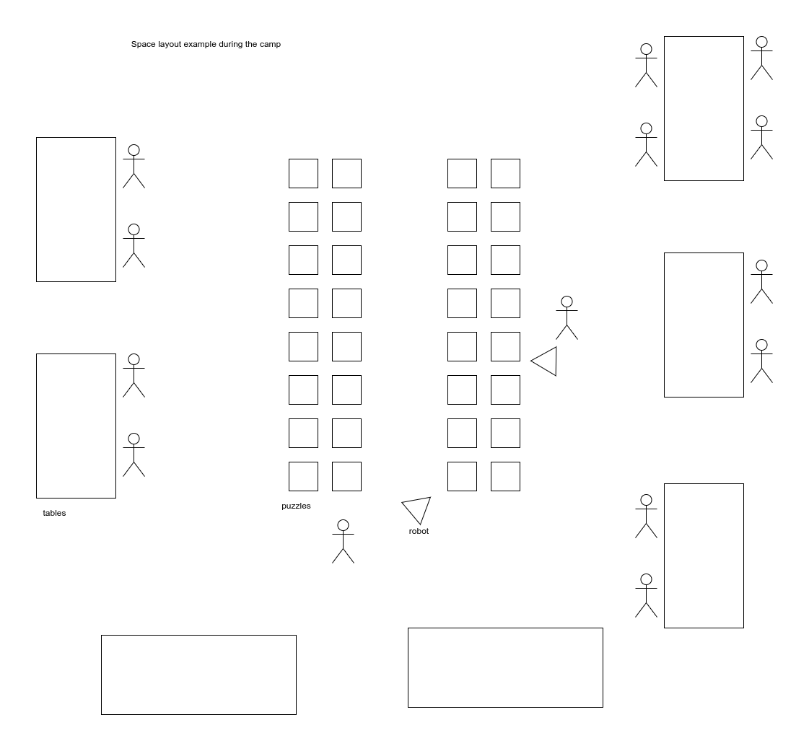

# diy-robo-camp

Purpose of this repo is to initiate discussion and form group of people who could be interested.

Concept of diy robotics camp

## Do-it-yourself camp, where participants come to solve robotics puzzles.

Similar to some hackathons or barcamps. 

Every participant is an organizer.
Every participant invests time and money to participate. For 1 day event it could be e.g. 50-100$.

## Content

During the event, participants will build or modify their robot, so it could solve available puzzles.

In this context, a puzzle is an assembly of ~30*30*30cm, that releases a ping-pong ball when solved. 
Simple puzzle could be e.g. a pressure plate that robot have to push with his own body.
Another puzzle could require pressing 3 buttons out of 5 in a specific order. Or a puzzle, where robot have two repeat played sound.
More complex puzzles may require advanced mechanics, image recognition, or special sensors.

When participants prepare for the camp, they should bring robots with all possible components/tools that they may need, and two puzzles created in advance. 

Participants themselves decide which puzzles they want to solve during the event and how. E.g. some may want to stick to RC and solve one puzzle at a time. Others may want to do it autonomous or try to collect at least 10 balls for a single run.

Example of the puzzle prototype:

https://experiments.makerobots.eu/experiments/2021-07-20_button-servo

Layout: 

## Prizes and winners

No prizes and winners. Reward is a possibility to develop your own skills, have fun and talk to same minded people.

## Purpose of the camp

Show to a wider audience that robotics could be fun and accessible for all ages and all levels of competence. 

